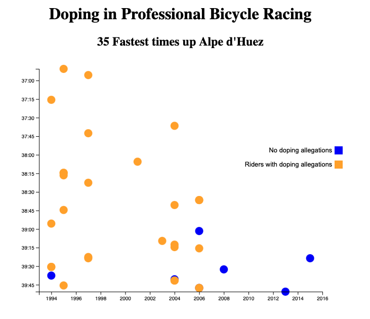

# 🚀 D3 Scatter Plot

This project displays a basic scatter plot with data from an XMLHttpRequest using D3 in TypeScript.

It was created for the freeCodeCamp data visualization certificate. The test suite can be removed by removing the last script tag in index.html

## Build
```
npm install
npm run build
```